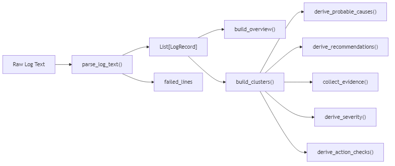
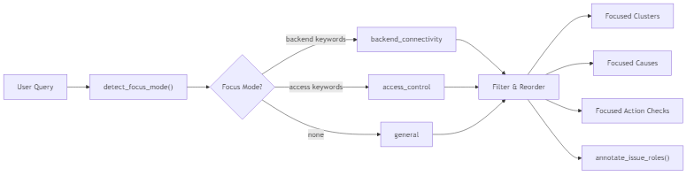
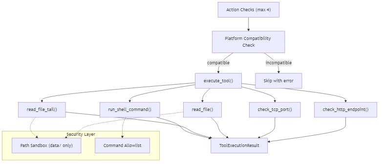
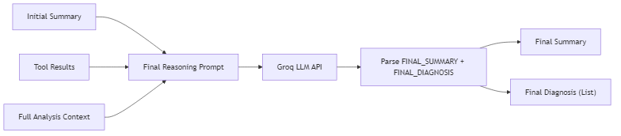
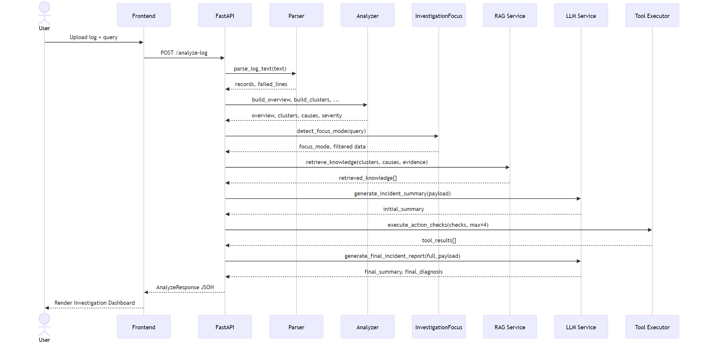

# 🤖 AI Agent Pipeline Design

## Tổng quan

AI Agent hoạt động theo mô hình **8-phase pipeline**, mỗi phase đảm nhận một bước trong quy trình điều tra sự cố. Agent kết hợp **rule-based analysis**, **RAG retrieval**, **LLM reasoning**, và **tool execution (function calling)**.

---

## Pipeline Flow

---

## Chi tiết từng Phase

### Phase 0 — Query Translation (LLM)
**Module:** `llm_service.py` → `translate_query_to_english()`

- Nếu user_query chứa ký tự non-ASCII (tiếng Việt), gọi Groq LLM để dịch sang tiếng Anh
- Nếu query là ASCII thuần → bỏ qua, dùng nguyên văn
- Nếu không có API key → trả về query gốc
- Kết quả (`translated_query`) được dùng cho RAG, LLM reasoning và Phase 0.5

---

### Phase 0.5 — Line Limit Extraction
**Module:** `routes.py` → `_extract_line_limit()`

- Parse user_query để phát hiện giới hạn dòng (ví dụ: "100 dòng đầu", "first 200 lines", "top 50 lines")
- Nếu phát hiện `line_limit`, cắt bớt text log trước khi parse
- Hỗ trợ cả tiếng Việt lẫn tiếng Anh

---

### Phase 1 — Parse & Cluster
**Module:** `parser.py` + `analyzer.py`

**Xử lý:**
- Parse log bằng regex pattern cho Apache error log format
- Normalize level (notice→INFO, crit→ERROR)
- Infer service từ message (mod_jk, workerEnv, jk2_init, client_request, apache)
- Cluster WARN/ERROR theo rule-based classification → 8 loại lỗi
- Derive nguyên nhân, recommendations, severity (HIGH/MEDIUM/LOW), evidence, action checks

**Severity thresholds (thực tế):**
- `HIGH` → `mod_jk workerEnv error state` count >= 100
- `MEDIUM` → `Directory access forbidden` count >= 20
- `LOW` → tất cả trường hợp còn lại

---

### Phase 2 — Focus by User Intent
**Module:** `investigation_focus.py`

**Xử lý:**
- Phân tích user_query bằng keyword matching → xác định focus mode
  - `backend_connectivity`: tomcat, ajp, port, backend, connectivity, connection, worker, workerenv
  - `access_control`: directory, forbidden, access, htaccess, allowoverride, index, directoryindex
- Reorder clusters: primary issues lên đầu, secondary xuống dưới
- Filter causes, recommendations, action checks theo focus mode
- Annotate primary issue vs secondary issues (max 3 secondary)

---

### Phase 3 — RAG Knowledge Retrieval
**Module:** `rag_service.py`

**Xử lý:**
- Build semantic query từ clusters + causes + evidence + user query (`translated_query`)
- Encode bằng `all-MiniLM-L6-v2`
- Query ChromaDB, lấy `max(top_k * 4, 12)` results
- Filter theo focus mode (drop access docs khi focus backend, ngược lại)
- Rank theo: focus relevance → doc_type (runbook > text_note > official_docs) → source
- Deduplicate (key = source + topic + page + first 120 chars) và trả về top-K

---

### Phase 4 — LLM Initial Reasoning
**Module:** `llm_service.py` → `generate_incident_summary()`

**Prompt Strategy:**
- System: "Bạn là trợ lý phân tích log Apache."
- Format cứng: 4 dòng (Overview / Primary Issue / Probable Cause / Priority Action)
- Constraint: bám sát user_query, ưu tiên retrieved_knowledge, không bịa
- Fallback khi không có API key → trả summary hardcoded tĩnh bằng tiếng Anh

---

### Phase 5 — Tool Execution (Function Calling)
**Module:** `tool_executor.py`

**Available Tools:**

| Tool | Mục đích | Ghi chú |
|------|---------|---------|
| `check_http_endpoint` | Kiểm tra backend HTTP | **Mocked trong demo** — luôn trả `unreachable` |
| `check_tcp_port` | Kiểm tra cổng TCP (AJP 8009) | Real socket check |
| `read_file` | Đọc file cấu hình | Path sandbox (`data/` only), max 4000 chars |
| `read_file_tail` | Đọc N dòng cuối log | Path sandbox, max 4000 chars |
| `run_shell_command` | Chạy command hệ thống | Allowlist: netstat, ps aux, ls -la, type, dir |

**Security:**
- File read: chỉ cho phép trong `data/` directory (`ALLOWED_READ_ROOTS`)
- Shell command: chỉ cho phép prefix trong `ALLOWED_COMMAND_PREFIXES`
- Platform check: skip tool nếu OS không tương thích (linux/windows/mac/any)

---

### Phase 6 — LLM Final Diagnosis
**Module:** `llm_service.py` → `generate_final_incident_report()`

**Prompt Strategy:**
- Input: tất cả data từ Phase 0–5 + tool results
- Output format cứng: `FINAL_SUMMARY:` + `FINAL_DIAGNOSIS:` (– bullets)
- Constraint: dùng tool_results cập nhật kết luận, phân biệt issue chính/phụ
- Ngôn ngữ thận trọng: "highly likely", "indicates", "supports the hypothesis"
- Fallback khi không có API key → trả summary và diagnosis hardcoded tĩnh

---

## Data Flow Summary

