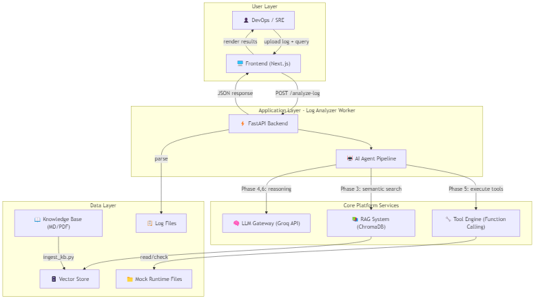
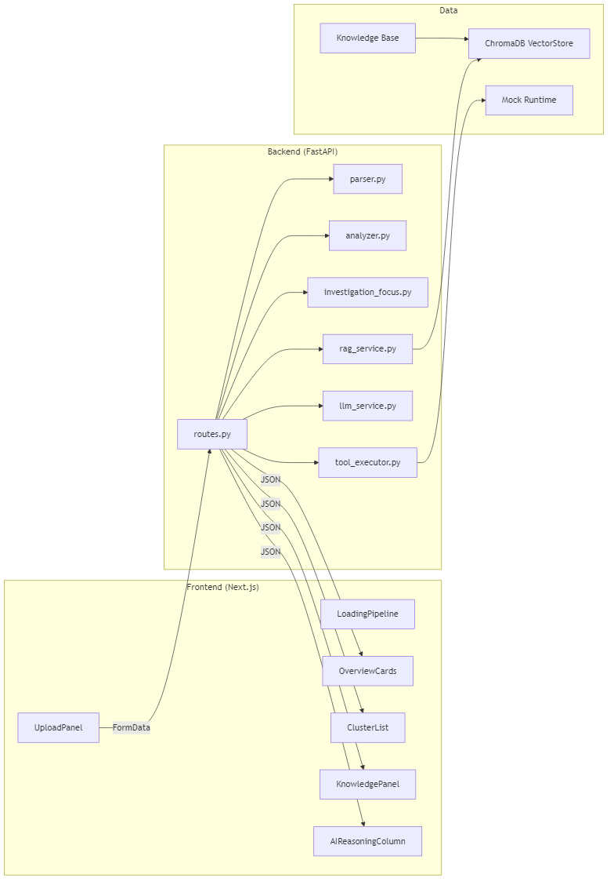
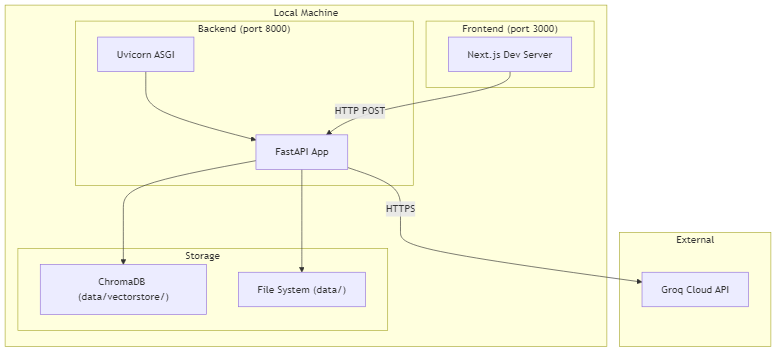

# 🏗️ System Architecture — AI Log Analyzer

## Tổng quan

**AI Log Analyzer** là một Digital Worker Application tự động phân tích log hệ thống (Apache/Server), tìm root cause bằng AI Agent kết hợp RAG và Function Calling.

Hệ thống nằm trong kiến trúc **Digital Worker Platform**, hoạt động như một **Application Worker** sử dụng các Core Platform Services.

---

## System Context Diagram

---

## High-Level Component Diagram

---

## Deployment Architecture

---

## Technology Stack

| Layer | Technology | Vai trò |
|-------|-----------|---------|
| Frontend | Next.js + TypeScript + Tailwind CSS | UI tương tác người dùng |
| Backend | FastAPI + Python 3.11 | REST API, orchestration |
| AI/LLM | Groq API (OpenAI-compatible) | Reasoning, summarization, translation |
| RAG | ChromaDB + sentence-transformers | Semantic search knowledge base |
| Embedding | all-MiniLM-L6-v2 | Vector encoding cho text |
| Tools | Python stdlib (socket, subprocess, pathlib) | Function calling execution |
| Testing | pytest + pytest-cov + httpx | Unit + Integration tests |
