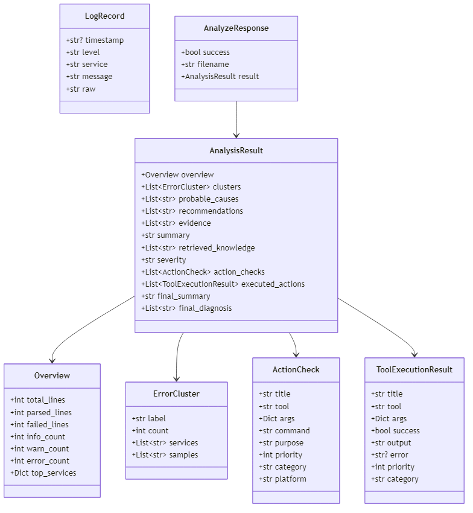

# 📦 Class & Module Diagram

## Backend Module Structure

```
app/
├── main.py                  # FastAPI app entry point, CORS middleware
├── api/
│   └── routes.py            # HTTP endpoints, 8-phase pipeline orchestration
├── core/
│   └── config.py            # Settings (GROQ_API_KEY, MODEL_NAME from .env)
├── models/
│   └── schemas.py           # Pydantic data models
├── services/
│   ├── parser.py            # Log text parsing (Apache format)
│   ├── analyzer.py          # Analysis engine (clusters, causes, severity)
│   ├── investigation_focus.py  # User intent detection & filtering
│   ├── rag_service.py       # RAG knowledge retrieval (ChromaDB)
│   ├── llm_service.py       # LLM API calls (Groq) + query translation
│   └── tool_executor.py     # Tool execution engine (sandboxed)
```

---

## Class Diagram



---

## Module Dependency Graph


---

## Key Functions per Module

### `parser.py`
| Function | Input | Output |
|----------|-------|--------|
| `parse_log_text(text)` | Raw log string | `(List[LogRecord], List[str])` |
| `normalize_level(level)` | Raw level string | Normalized level (INFO/WARN/ERROR/DEBUG) |
| `infer_service_from_message(msg)` | Log message | Service name (mod_jk/workerEnv/jk2_init/client_request/apache) |

### `analyzer.py`
| Function | Input | Output |
|----------|-------|--------|
| `normalize_message(msg)` | Log message | Normalized string (strips IDs, numbers) |
| `classify_message(msg)` | Log message | Cluster label (one of 8 categories) |
| `build_overview(records, failed)` | Parsed records + failed lines | `Overview` (with `failed_lines_content`) |
| `build_clusters(records)` | Parsed records | `List[ErrorCluster]` (only WARN/ERROR, sorted by count desc) |
| `derive_probable_causes(clusters)` | Clusters | `List[str]` |
| `derive_recommendations(clusters)` | Clusters | `List[str]` (deduped) |
| `derive_severity(clusters)` | Clusters | `"LOW"/"MEDIUM"/"HIGH"` |
| `collect_evidence(clusters)` | Clusters | `List[str]` (max 6, from top 3 clusters x 2 samples each) |
| `derive_action_checks(clusters)` | Clusters | `List[dict]` (sorted by priority asc) |

### `investigation_focus.py`
| Function | Input | Output |
|----------|-------|--------|
| `detect_focus_mode(query)` | User query | `"general"/"backend_connectivity"/"access_control"` |
| `is_backend_related_label(label)` | Cluster label | `bool` |
| `is_access_related_label(label)` | Cluster label | `bool` |
| `filter_clusters_by_focus(clusters, mode)` | Clusters + mode | Reordered clusters (primary first) |
| `filter_list_by_focus(items, mode)` | String list + mode | max 5 items (4 primary + 1 secondary) |
| `filter_action_checks_by_focus(checks, mode)` | Action list + mode | max 4 primary actions |
| `annotate_issue_roles(clusters, mode)` | Clusters + mode | `(primary_label, List[secondary_labels])` max 3 secondary |

### `rag_service.py`
| Function | Input | Output |
|----------|-------|--------|
| `build_retrieval_query(labels, causes, evidence, query)` | Analysis context | Semantic query string (empty → no search) |
| `_doc_type_rank(meta)` | Doc metadata | Priority int (0=runbook, 1=text_note, 2=official_docs, 3=other) |
| `_is_backend_doc(meta)` | Doc metadata | `bool` |
| `_is_access_doc(meta)` | Doc metadata | `bool` |
| `_should_drop_doc(meta, mode)` | Doc metadata + mode | `bool` (drop if mismatches focus) |
| `_focus_rank(meta, mode)` | Doc metadata + mode | Priority int (0=relevant, 10=not relevant) |
| `retrieve_knowledge(labels, causes, evidence, query, top_k)` | Analysis context | `List[str]` formatted KB docs |

### `llm_service.py`
| Function | Input | Output |
|----------|-------|--------|
| `translate_query_to_english(user_query)` | User query (any language) | Translated query (or original if ASCII/no key) |
| `generate_incident_summary(payload)` | Full analysis payload | Summary string (4-line format) |
| `generate_final_incident_report(payload)` | Payload + tool results | `(final_summary: str, final_diagnosis: List[str])` |

### `tool_executor.py`
| Function | Input | Output |
|----------|-------|--------|
| `_current_platform()` | — | `"windows"/"linux"/"mac"/"unknown"` |
| `_is_path_allowed(path)` | File path | `bool` (must be under `data/`) |
| `_check_platform_compatibility(platform)` | Platform string | `(bool, error_msg)` |
| `check_http_endpoint(url, timeout)` | URL | `{"reachable": bool, "detail": str}` — **mocked in demo** |
| `check_tcp_port(host, port, timeout)` | Host + port | `{"reachable": bool, "detail": str}` — real socket |
| `read_file(path)` | File path | `{"ok": bool, "content": str}` — max 4000 chars |
| `read_file_tail(path, lines)` | File path + N | `{"ok": bool, "content": str}` — max 4000 chars |
| `run_shell_command(command)` | Shell command | `{"ok": bool, "output": str, "returncode": int}` |
| `execute_tool(tool, args)` | Tool name + args | Raw result dict |
| `execute_action_checks(checks, max_actions=4)` | Action list | `List[ToolExecutionResult]` |

---

## Pydantic Model Field Reference

### `Overview`
```python
total_lines: int
parsed_lines: int
failed_lines: int            # count
failed_lines_content: List[str] = []   # actual content, max 50
info_count: int
warn_count: int
error_count: int
top_services: Dict[str, int] # service_name → count, top 5
```

### `ErrorCluster`
```python
label: str          # one of 8 categories
count: int
services: List[str] # top 3 services
samples: List[str]  # max 3 raw log lines
```

### `ActionCheck` (Pydantic model)
```python
title: str
tool: str
args: Dict[str, Any]
command: str
purpose: str
priority: int
category: str
platform: str = "linux"  # default is linux
```

### `ToolExecutionResult`
```python
title: str
tool: str
args: Dict[str, Any]
success: bool
output: str
error: Optional[str] = None
priority: int
category: str
```
