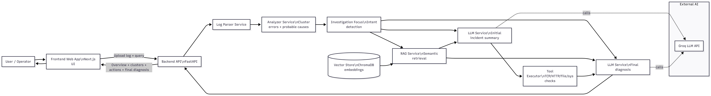

# HACKATHON PROJECT REPORT

## 1. Project Overview

* **Project Name:** Apache server's log analyzer
* **Team Name:** Exodia
* **Team Members:**
- Nguyễn Anh Tín: QE200034
- Nguyễn Trí Thiện: QE200082
- Hà Đặng Quốc Toàn: QE200006
- Lê Gia Bảo: QE200316
- Nguyễn Trung Hiếu: QE200041

### Problem Statement
- Devs have to read logs manually in oder to find errors => Take a huge ammount of time
### Proposed Solution
- By employing a RAG-based LLm, our solution processes logs to pinpoint the system failure and generate solutions advice
---

## 2. Objectives

To automate 60% of the web server's troubleshooting and remediation workflows, significantly reducing manual intervention

---

## 3. System Architecture

### High-Level Architecture

---

## 4. Technologies Used

| Category | Technology |
| -------- | ---------- |
| Frontend |nextjs/css    |
| Backend  |Fast API, Uvicorn, python            |
|embedding model|all-MiniLM-L6-v2|
| Database |chromadb (vectordb)            |
| AI    |Groq API            |

